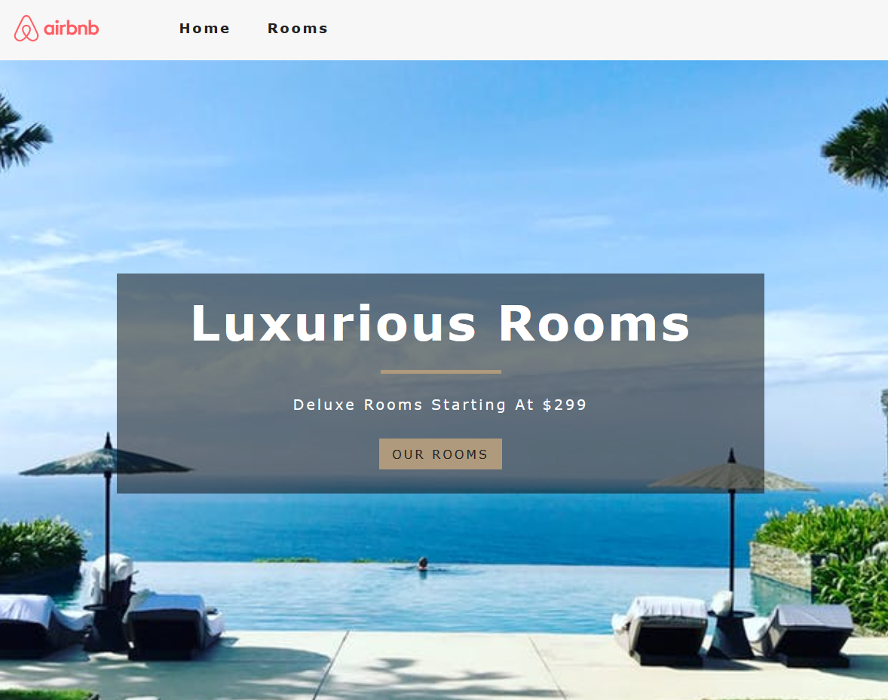

## To Get Started
### `yarn install` OR `npm install`
### `yarn start` OR `npm start`
### Add a file called `env.development` with two keys

Link to website: https://airbnbwebsite.netlify.app/

Resources used: Contentful (for data), React router (for page routing), Styled-components (for styling), React context API (to use context in different components), React hooks, Funcitonal components and some class based components. 

